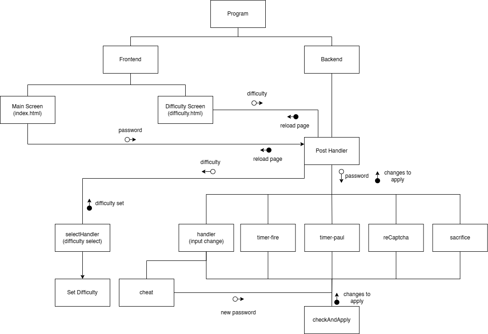
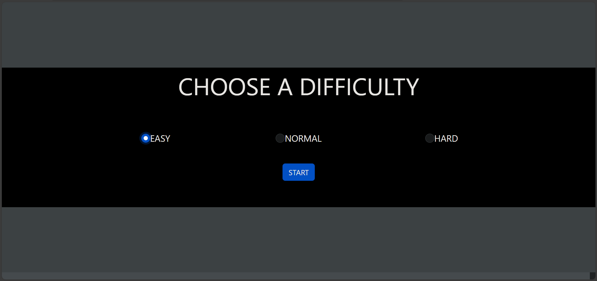
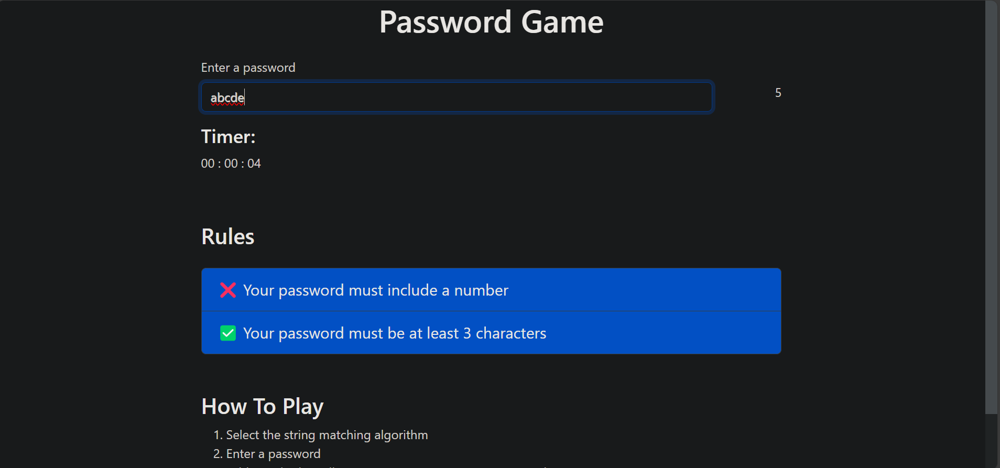
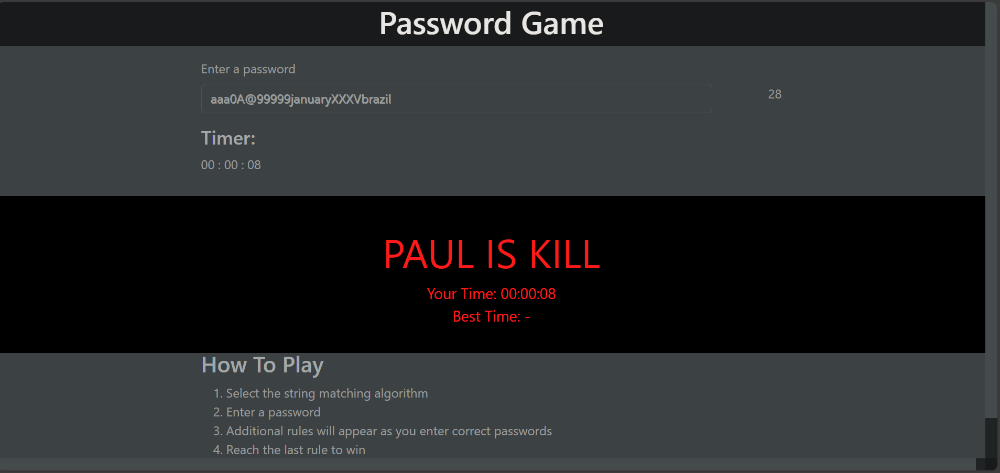
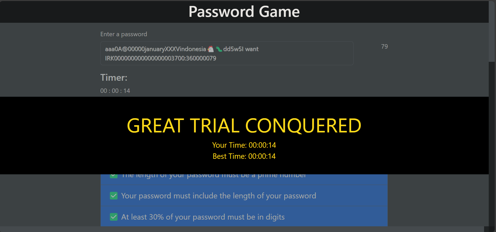

# PASSWORD GAME
## Description
A redux of the neal.fun/password-game with slight changes to the rules. Make a password with up to 20 rules. Go through all 20 rules to win the game. Some rules will cause you to lose instantly. Type "cheat" into the entrybox to see an answer.

## Technologies Used
* Go Language
* Bootstrap 5
* HTMX
* Docker
* sqlite3

## Program Structure


## String Matching Algorithm Used
The program mainly uses **Regex** to check for patterns in the password. For example, it is used to check for number (rule 2), month (rule 6), country name (rule 8), captcha (rule 12), time (rule 20), as well as certain emojis (rule 10, 11, 14). Regex is used instead of other string matching algorithm (e.g. Knuth Morris Pratt or Boyer Moore) due to its flexibility. This is useful when checking for rules that allow spaces in the pattern. It is especially useful for rule 9, since the roman numeral "I" can be put in between without changing the result of the multiplication (e.g. VII V can multiply to 35; so can VII I V, I VII V, and VII V I)

## Executing program
* Run in localhost
  1. Open the terminal from the root directory
  ```
  cd Password-Game_13522002_Ariel-Herfrison
  ```
  2. Build the docker image
  ```
  docker build . -t [image-name]
  ```
  3. Run the docker container
  ```
  docker run -p 1334:1334 [image-name]
  ```
  *make sure docker desktop is running
* Run from the internet
  1. Open the following link: https://passwordgamelite-nvvtv47y.b4a.run/

## Screenshots
* Difficulty screen

The screen that first appears when you start the game. You can choose one of three difficulties: Easy, Normal, or Hard. After that, press "Start" to start the game.
* Main screen

The main screen where you can play the game. Enter your password in the entry box. The page will show you the rules as you enter correct passwords as well as a timer that shows you the time it took for you to complete the game. At the bottom there is an additional how-to-play guide.
* Game over screen

The screen that appears when you get a game over scenario. Currently there are 3 game over scenarios: when you delete the egg (rule 11), when you delete the chicken (rule 14), and when you forget to feed the chicken (rule 14).
* Win screen

The screen that appears when you complete all 20 rules. The page will show you the amount of time it took for you to complete the game as well as the best time you had during the session.
  
## Authors
Ariel Herfrison

## Acknowledgments
* [Password-Game](https://neal.fun/password-game/)
* [Bootstrap-5-Docs](https://getbootstrap.com/docs/5.0)
* [Golang-HTMX-Guide-by-BugBytes](https://www.youtube.com/watch?v=F9H6vYelYyU&t=1403s)
